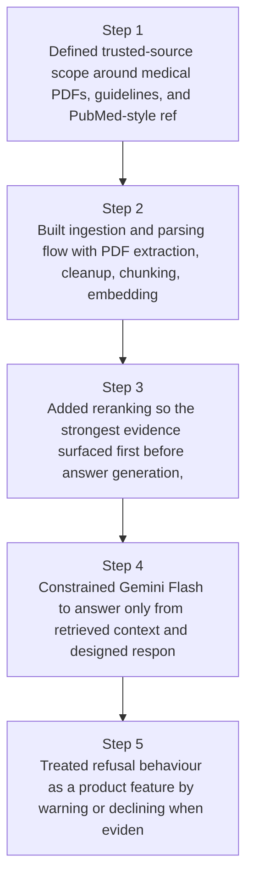
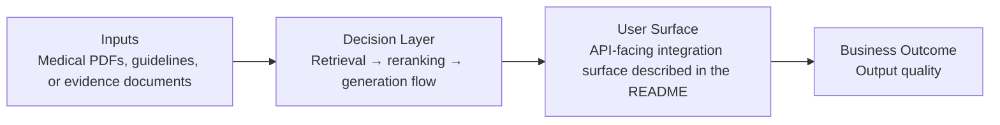
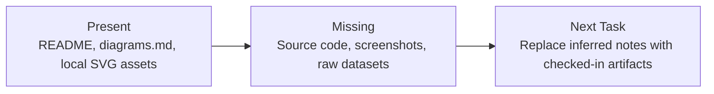

# Medical Evidence Q&A Assistant Diagrams

Generated on 2026-04-26T04:29:37Z from README narrative plus project blueprint requirements.

## RAG pipeline architecture

## Retrieval → reranking → generation flow

## Evidence Gap Map

